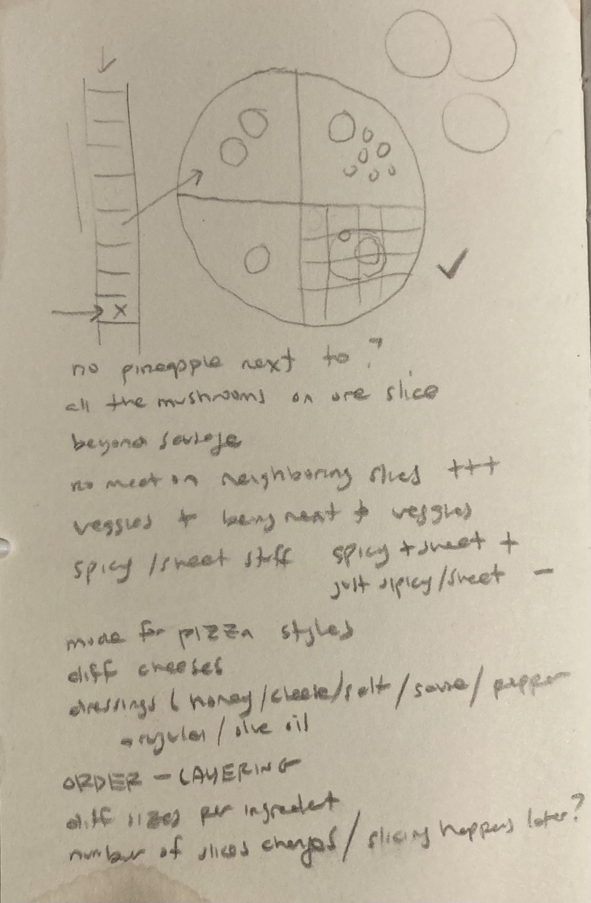
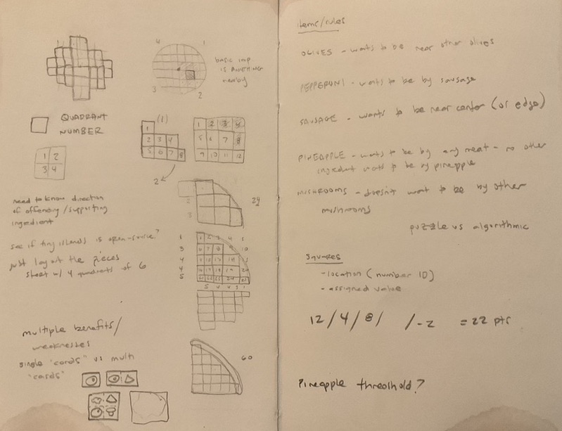
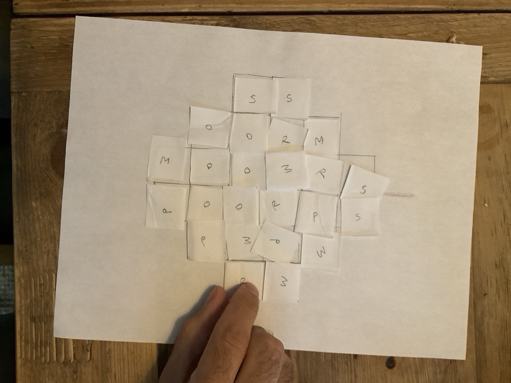

# Process Documentation

## 09.07.22 - Initial Thinking

### Project / sketch goals
* At a most fundamental layer, exploration of using Wwise within Unity for sound/music control
* Deeper than this, though is: **how can we use sound to communicate game-state in a more engaging way?**
* Make a "fun" thing
 
### An idea
Roll and writes are an enjoyable game-style, but often you are not entirely sure if you're doing "well" as you are playing. 
Smaller examples like [Yahtzee](https://en.wikipedia.org/wiki/Yahtzee) and [Qwixx](https://gamewright.com/product/Qwixx) make it easier to follow (especially with how the scoring sheets are laid out), but more robust examples could benefit from some added illumination[1](#####1).
Is this what is stopping more complex board-based roll and writes ([Dinosaur Island: Rawr 'N Write](https://pandasaurusgames.com/products/dinosaur-island-rawr-write) comes to mind[2](######2) ) from being more widely-adopted on digital platforms?

In particular, making a game similar to David King's wonderful [Tiny Islands](https://dr-d-king.itch.io/tiny-islands) feels like an interesting space to be exploring these ideas.

With these things in mind...

### Brainstorming

Immediately the idea of laying out pizza toppings (rather than island-town attractions) seems fun. 
At lunch with the 'lilionairesTM we start brainstorming what kind of goals/restrictions you could implement.

#### Compelling Ideas:
* certain foods don't want to be next to others (i.e pineapple[3](#####3) )
* trying to separate out half/quarter pies for different goals (meat lovers, veggie, dairy-free?)
* spicy/sweet stuff as bonuses
* rotating through quadrants for placement
* a "conveyer-belt" style delivery of ingredients for immediate placement
* the ability to slice after the fact? (more complicated and possibly harder to implement the desired audio, but an interesting game idea)

### Onward!

So Purrrfect Pizzas[4](#####4) is born, a digital roll and write where you try to make perfect pizzas to please your picky patrons. 
It  practically makes itself! Except that it doesn't. That's what the next month is for. First step: quick and dirty paper prototypes to get some very rough ideas of the overall loop.

### Notes

##### 1 Question: if Yahtzee is so named because it was invented on a boat, then why isn't it Yachtzee? They've taken the C out of a game intended for a yacht (all puns intended)
##### 2 Oddly enough, Dinosaur Island: Rawr 'N Write appears to have a [digital companion app](https://apps.apple.com/us/app/rawr-n-write/id1587414158) to help in the tedious chore of score-keeping, so maybe the argument is moot
##### 3 Calm down
##### 4 I mean, c'mon

## 09.19.22 - Paper Prototyping

The great Mathew Sisson visited this week, and we went through a quick prototype that emerged from some rough sketching.
These initial sketches led to a couple ideas of how the game could be laid out and played. 

A 5x5 grid would give 60 possible spaces total if one space was added per column for each quarter of the pie (see sketch above). 
This feels appropriate for eventual development (and maybe even including flexible sizes[5](#####5)), but for the initial digital game sketch it seems beneficial to stick to a smaller play area.
The smaller size of 3X3 leads to 24 total spaces, which will allow for some experimentation with the sonic parameters (which, after all is the main goal here).

### Simple Items/Rules

While it feels natural/obvious to have multiple toppings per card[6](#####6), these early iterations will focus on single ingredients.
Additionally, the question arises as to how those items are delivered to the player (and placed, for that matter).
For the sake of simplicity, this first iteration will randomly deliver the available ingredients one at a time, and the player will place them accordingly.

The ingredients along with their "rules" and tile quantities were as follows:
* Mushrooms (M) x6 - doesn't want to be near other mushrooms
* Olives (O) x6 - wants to be near other olives
* Pineapple (P) x4 - wants to be near meat, but no other ingredient wants to be near pineapple 
* Pepperoni (R) x4 - wants to be near sausage
* Sausage (S) x4 - wants to be near the crust

### Takeaways:

* The points awarded were fairly arbitrary (+1 for each olive near another olive, for example) and definitely need to be tweaked in future iterations.
* Equal numbers of items as spaces on the playfield has the potential to make the game function as a solvable problem (especially if all ingredients were available at once rather than one by one). This isn't necessarily a bad thing, and could be explored further, but the next iteration will include blank spaces to see how that effects gameplay.
* Perhaps Pineapple has a bell-curve points effect (i.e 1 pineapple = 2 points, 2 pineapples = 5, but more than that and the points reduce?)

### Next Stage:
Bringing this rough version into Unity and beginning to work on the Audio

### Notes

##### 5 and different shapes and styles! Grandma pie! Detroit style! Freeform! Deep dish!
##### 6 an obvious touchstone here is [Circle the Wagons](https://buttonshygames.com/pages/circle-the-wagons) or Matt Sisson's own [Strawberry Sunset](https://stellarfactory.com/en-ca/products/strawberry-sunset) though there are some really interesting tweaks that could be made here, namely square cards instead of rectangular, and cards in which certain ingredients cover up more than one quadrent (i.e cheese). This brings in the fun possibility of stacking these cards to assemble more pleasing creations and introduces strategy to eliminate negative pairings 

## 09.20.22 - First Digital Implementation

### 
### Assets Used:
These will (probably) all be updated in future versions of this, particularly with interest seeing how Procreate can be used for original asset creation (thanks for the rec [Z](https://github.com/zSpaceSheikh/)!), but for this iteration the project includes:
* [Pizza Topping Icons](https://dribbble.com/shots/1373753-Pizza-toppings) by [Xue Ao Zhang](https://www.xue-ao.com/)
* Display Font: [Fredericka the Great](https://fonts.google.com/specimen/Fredericka+the+Great) - Designed by Tart Workshop
* Body Font: [Montserrat](https://fonts.google.com/specimen/Montserrat) - Designed by Julieta Ulanovsky, Sol Matas, Juan Pablo del Peral, Jacques Le Bailly 